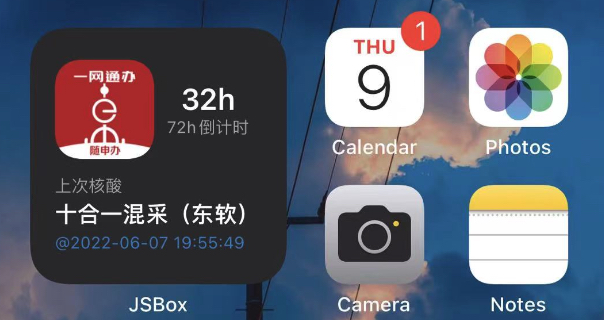
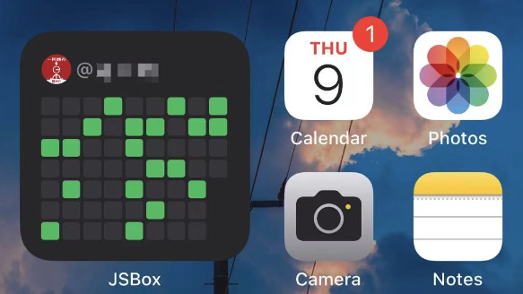

# COVID-19_ios_widget
上海核酸倒计时提示桌面组件，72小时内，自动提示一下。

### 效果

* 自动获取最后一次核酸检测记录，还有多长时间超过72小时

* 获取最近的一些核酸记录，每一列7天，就是一周。最右边是当前周。

### 需要
* JSBOX，添加widget
* 自己会抓包，小程序点一下随申码，就会有那个网络请求。按照代码修改下个人信息。
* 安装「小捷径」App：点击可以跳转到随申码小程序页面。

### 买杯咖啡
